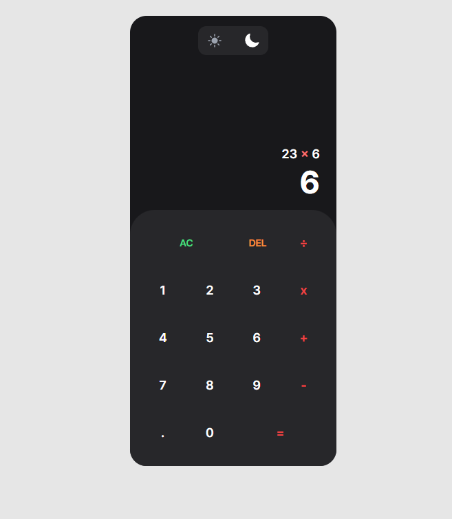

# Calculator App (styled with Tailwind CSS)

Simple Calculator

## Table of contents

- [Overview](#overview)
  - [The challenge](#the-challenge)
  - [Screenshot](#screenshot)
  - [Links](#links)
- [My process](#my-process)
  - [Approach](#approach)
  - [Built with](#built-with)

## Overview

This app is a simple calculator that allows users to perform basic math operations such as addition, subtraction, multiplication, and division. The app has a clean and user-friendly interface, with large buttons and an easy-to-read display. One of the key features of the app is the ability to switch between light and dark mode, providing users with the flexibility to choose the theme that best suits their preferences.

### The challenge

Users should be able to:

- Perform basic math operations
- Change the theme of the Calculator

### Screenshot

### Links

- Live Site URL: [https://calculator-app-mariocesena.netlify.app/]

## My process

### Approach

This app provides a straightforward solution for basic math operations, leveraging the powerful useReducer hook to efficiently manage the state of the result and operation being performed. With this functionality, users can keep track of their calculations in real-time, improving the user experience.

Additionally, the app includes a customizable toggle switch that enables users to easily switch between light and dark modes, providing a more personalized and comfortable viewing experience. Tailwind CSS is the framework that makes this feature possible, allowing for seamless and effortless styling.

### Built with

- Semantic HTML5 markup
- Tailwind CSS
- Grid/Flexbox
- [React](https://reactjs.org/) - JS library
- Vite JS
